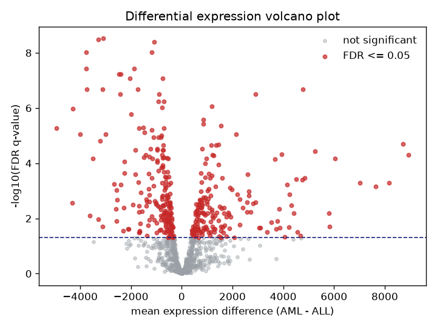

# High-dimensional genomics ML

A small research note, with runnable code, on the classic wide-data problem in
genomics: many thousands of genes measured across only a few dozen patients. The
worked example is the Golub leukemia microarray set, 72 patients across 7129
genes, split into two subtypes, acute lymphoblastic leukemia (ALL) and acute
myeloid leukemia (AML).

## Question

Given a gene-expression matrix where genes vastly outnumber samples:

1. Can supervised models separate the two leukemia subtypes from expression alone?
2. Which genes are differentially expressed between subtypes, controlling the
   false discovery rate?
3. Does unsupervised structure, PCA plus k-means, recover the subtype labels on
   its own?

## Method

The pipeline lives in `src/hdgenomics/` and runs end to end from
`scripts/analyze.py`:

- Filter to the top 1000 most variable genes, then standardize each gene to zero
  mean and unit variance. Standardization statistics are fit inside each
  cross-validation fold so no information leaks from test to train.
- PCA to two components and k-means with k = 2, scored against the true labels
  with the adjusted Rand index.
- Cross-validated classification comparing logistic regression, a linear SVM, and
  a random forest under shared 5-fold stratified splits and a fixed seed.
- Per-gene Welch t-tests for differential expression, corrected with a
  Benjamini-Hochberg FDR procedure implemented from scratch in `stats.py` and
  unit tested against reference q-values from R's `p.adjust`.

The default entry point runs fully offline on `data/leukemia_sample.csv`, a
committed carve-out of the public Golub matrix (all 72 samples, the top 1000 most
variable genes, 348 KB). `scripts/download_data.py` fetches the full matrix from
OpenML for a whole-genome run.

## Findings

Measured in this repository on the committed sample, seed 0, 5-fold stratified
cross-validation. Full metrics in `results/metrics.json` and `RESULTS.md`.

Supervised separation is strong. Differential expression is abundant. Unsupervised
structure does not recover the labels.

| Result                                | Value |
|---------------------------------------|-------|
| PCA explained variance (PC1, PC2)     | 0.165, 0.120 |
| Logistic regression CV accuracy       | 0.958 +/- 0.057 |
| Linear SVM CV accuracy                | 0.944 +/- 0.053 |
| Random forest CV accuracy             | 0.986 +/- 0.029 |
| Differential genes at FDR 0.05        | 362 of 1000 |
| K-means vs true labels (adjusted Rand)| 0.016 |

The volcano plot shows mean expression difference (AML minus ALL) against the
FDR-adjusted significance, with genes passing FDR 0.05 highlighted.



The near-zero adjusted Rand index is a genuine negative result and worth stating
plainly: the dominant axes of variation in the standardized expression are not
the ALL/AML contrast, so k-means over the most variable genes does not recover
the diagnostic split. The supervised signal is clearly present, it is just not
the largest source of variance. The PCA scatter that supports this is in
`results/pca.png`.

The committed sample is exactly the top 1000 most variable genes the pipeline
selects from the full matrix, so the PCA, clustering, and linear-classifier
numbers reproduce a full-matrix run. On the full 7129-gene matrix the
differential-expression step flags 1056 genes of 7129 at FDR 0.05; the sample
reports a higher fraction because it is enriched for the most variable genes.

## Reproduce

```bash
python -m venv .venv && source .venv/bin/activate   # Windows: .venv\Scripts\activate
pip install -e ".[dev]"

# Offline quickstart on the committed sample (no network, about 30 seconds):
python scripts/analyze.py          # writes results/pca.png, results/volcano.png, results/metrics.json
python scripts/benchmark.py        # model comparison table

# Whole-genome run:
python scripts/download_data.py --out data/leukemia.csv
python scripts/analyze.py --csv data/leukemia.csv
```

Tests and linting:

```bash
pytest -q
ruff check src tests scripts
```

## Limitations

- Two-class comparisons only for differential expression.
- No batch-effect correction and no gene-set enrichment. The genes flagged are
  reported as statistics, not interpreted biologically.
- The models are deliberately standard. The point is honest measurement on wide
  data, not a leaderboard score, and with 72 samples the between-model
  differences should not be over-read.
- The committed sample is a most-variable-gene subset, so its differential-
  expression fraction is not representative of the whole genome. Use the full
  matrix for that number.

## Layout

```
src/hdgenomics/   data, preprocess, dimreduce, classify (logreg/svm/rf), stats (BH-FDR)
scripts/          download_data.py, analyze.py, benchmark.py
notebooks/        demo.ipynb (executed on the sample)
tests/            pytest suite incl. FDR reference-value and pipeline checks
data/             leukemia_sample.csv committed; full matrix gitignored
results/          pca.png, volcano.png, metrics.json (committed)
```

## License

MIT, see [LICENSE](LICENSE).

## Author

Aamir Malik. [GitHub](https://github.com/aamirmalik-dr) ·
[LinkedIn](https://linkedin.com/in/dr-aamirmalik)
